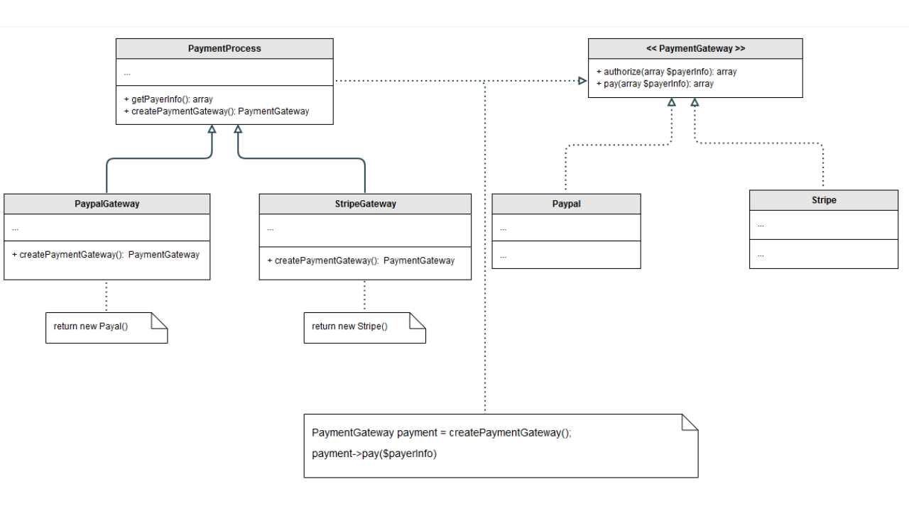

# Factory

The Factory Method Pattern, as described in the Gang of Four book, is one of the Creational Design Patterns. It provides an interface for creating objects but allows subclasses to alter the type of objects that will be created. This is useful when the exact type of object that needs to be created is determined at runtime.

## Intent

Defines an interface for creating an object, but lets subclasses decide which class to instantiate. It lets a class defer instantiation to subclasses.

## Key Participants:

1. **Product (Interface/Abstract Class):** Defines the interface or the abstract class that all concrete products will implement.

2. **ConcreteProduct (Concrete Class):** These are the concrete classes that implement the Product interface.

3. **Creator (Abstract Class):** Declares the factory method, which returns a Product object. This can be abstract or contain some default logic.

4. **ConcreteCreator (Concrete Class):** Implements the factory method to return an instance of a ConcreteProduct.

## Example Scenario: Payment Gateways



Let’s go through an example of using the Factory Method Pattern to create instances of payment gateways like PayPal and Stripe. The key idea here is that the PaymentProcess class does not need to know the details about whether it will use PayPal or Stripe. The creation of the concrete gateway is delegated to subclasses.

### Step 1: Define the `Product` Interface

First, we define an abstract `PaymentGateway` interface that both `PayPal` and `Stripe` gateways must implement.

```typescript
interface PaymentGateway {
    authorize(payerInfo: any[]): any[];
    pay(payerInfo: any[]): any[];
}
```

### Step 2: Concrete implementations of Product `(PayPal and Stripe)`

ext, we create concrete classes `PayPal` and `Stripe`, which implement the `PaymentGateway` interface. These are the actual products that will be created by the factory.

```typescript
class Paypal implements PaymentGateway {
    authorize(payerInfo: any[]): any[] {
        console.log("Authorizing payment via PayPal...");
        return payerInfo;
    }

    pay(payerInfo: any[]): any[] {
        console.log("Processing payment via PayPal...");
        return payerInfo;
    }
}

class Stripe implements PaymentGateway {
    authorize(payerInfo: any[]): any[] {
        console.log("Authorizing payment via Stripe...");
        return payerInfo;
    }

    pay(payerInfo: any[]): any[] {
        console.log("Processing payment via Stripe...");
        return payerInfo;
    }
}
```

### Step 3: Creator (Abstract Class)

Now we define an abstract `PaymentProcess` class. This is the Creator in the factory method pattern. It declares the factory method `createPaymentGateway()` which will return a `PaymentGateway` object.

```typescript
abstract class PaymentProcess {
    abstract createPaymentGateway(): PaymentGateway;

    deliveryAddress(): void {
        console.log("Processing delivery address...");
    }
    
    processOrder(payerInfo: any[]): void {
        const gateway = this.createPaymentGateway();
        gateway.authorize(payerInfo);
        gateway.pay(payerInfo);
    }
}
```

### Step 4: Concrete Creators (`PayPal` and `Stripe` Gateways)

The `PaypalGateway` and `StripeGateway` classes are Concrete Creators. They override the `createPaymentGateway()` method to instantiate the appropriate gateway.

```typescript
class PaypalGateway extends PaymentProcess {
    createPaymentGateway(): PaymentGateway {
        return new Paypal();
    }
}

class StripeGateway extends PaymentProcess {
    createPaymentGateway(): PaymentGateway {
        return new Stripe();
    }
}
```

### Step 5: Client Code

The client code creates instances of the concrete creator (`PaypalGateway` or `StripeGateway`) but doesn't need to know the specific details of the gateway being used. It just calls the factory method and processes the order.

```typescript
function main() {
    const payerInfo = [{ "email": 'client@client.com', 'amount': 19.99 }]

    // Using Paypal checkout
    const paypalCheckout = new PaypalCheckout();
    paypalCheckout.deliveryAddress();
    paypalCheckout.processOrder(payerInfo);

    // Using Stripe checkout
    const stripeCheckout = new StripeCheckout();
    stripeCheckout.deliveryAddress();
    stripeCheckout.processOrder(payerInfo);
}

main();
```

## Explanation:

* Product Interface (`PaymentGateway`): This defines the operations that both `PayPal` and `Stripe` gateways must implement.
* Concrete Products (`PayPal` and `Stripe`): These are concrete classes that implement the `PaymentGateway` interface, representing the actual objects created by the factory. 
* Creator (`PaymentProcess`): This defines the factory method `createPaymentGateway()`, which returns a `PaymentGateway`. It contains common logic for payment process operations, but defers the creation of specific payment gateways to subclasses. 
* Concrete Creators (`PaypalGateway` and `StripeGateway`): These are the subclasses of `PaymentProcess`. They override the createPaymentGateway() method to return the appropriate concrete product (either `PayPal` or `Stripe`).

## When to Use the Factory Method Pattern:

1. You want to delegate the responsibility of object creation to subclasses.
2. You have multiple potential subclasses or products and want the decision of which one to instantiate to be made by subclasses.
3. You need to avoid tight coupling between the creator and the concrete products.

This pattern is beneficial in scenarios where you have multiple ways of creating objects, but you want to keep the client code flexible by delegating the instantiation to specific subclasses.
Example in Real World:

In many modern applications, you might use the factory method to select a logging framework, database connector, or payment gateway at runtime. For instance, an e-commerce application might switch between different payment providers (PayPal, Stripe, etc.) based on the user’s region or preferences without modifying the core logic for processing payments.